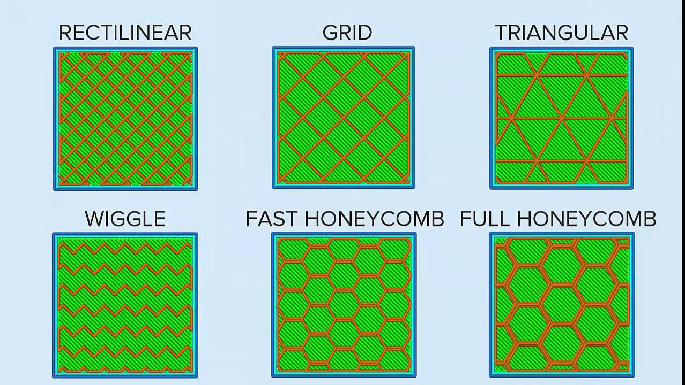

# Usage

The following section covers everything from finding and downloading models, to the actual process of printing a model.

## Contents

- [Finding a model](#finding-a-model)
	- [The limits of a 3D printer](#the-limits-of-a-3d-printer)
	- [Finding Models](#finding-models)
- [Exporting G-code](#exporting-g-code)
	- [What is G-code](#what-is-g-code)
	- [Slicers](#slicers)
	- [Slic3r Usage](#slic3r-usage)
	- [Importing STL Files](#importing-stl-files)
- [Printing](#printing)
	- [Pronterface](#pronterface)
	- [Printing](#printing)
- [Troubleshooting](#troubleshooting)

## Finding a model

#### The limits of a 3D printer

3D printers are powerful machines, however they also have their limits. Such limits include their printing size, accuracy, speed, choice of material and the inability to print at steep angles without required support. 3D prints also frequently suffer from failure as environmental factors may affect the printers performance, that are otherwise not present or greatly reduced, in industrial alternatives.

As a result, we can conclude that a 3D printer can only print a limited set of models.

Models with flat surfaces and little to no steep curves are known to perform best, where models with complex dense patterns or steep curves are likely to fail.

The chance of failure can typically be reduced by selecting the correct printing configuration and by adjusting parameters such as the temperature or printing speed. However, these adjustments will be further covered in the [Exporting to gcode](#exporting-to-gcode) section. This section only covers the models.

As time has passed, printers have yielded better and better results. This documentation only covers the some-what outdated DSP Informatik AG 3D printer, which performs poorly at printing complex models.

#### Finding Models

The perhaps biggest collection of free 3D printable models is provided by [thingverse](thingverse.com), a community driven website where anyone can publish their 3D models.

To find a specific model, simply enter a keyword into the search bar. In most cases, multiple models will match the search. When choosing between models, keep the complexity of the model in mind. Remember, complex models are likely to fail on the Informatik AG printer.

After a desired model has been selected, download it and look for the file(s) ending with the `.stl` extension.

## Exporting G-code

#### What is G-code

Nearly all 3D printers operate on a minimalistic programming language called G-code. G-code is a numerical control programming language mainly used for computer aided manufacturing. Instructions are typically very primitive, such as moving the printer left, right, back, front, up and down, setting the hotend and heatbed temperature or telling the printer to extrude a specific amount of filament. More complex Instructions, such as homing the printer, are firmware specific.

G-code Instructions typically begin with a capital G followed by the ID of an command, optionally further followed by additional command parameters.

For instance, `G0` orders the printer to move a certain position on a certain axis. The axis and final position are provided as further parameters:

Move to 50mm on the X axis
```gcode
G0 X50
```

Additional G-code commands can be explored [here](https://reprap.org/wiki/G-code)

Commands that begin with a capital M, indicate instructions specific to printers running the open source [Marlin](http://marlinfw.org/) firmware, which is used by our printer..

#### Slicers

For a 3D printer to print a provided model, it must first be split into layers. This process is called slicing. There is a variety of slicing software available, however, we are relying on [Slic3r](http://slic3r.org/). Slicing software takes a model, splits it into layers of given size, such as 0.1mm and then converts those layers into G-code. The generated gcode contains all the necessary instructions to print the model layer by layer. Additionally, slicing software will try its best optimize the print, and will often use tricks to save filament, such as the usage of infill patterns.

Infill is used to fill the inside of a 3D print. It is never recommended to print with full (100%) infill, instead infill patterns are used which will only fill the inside of an just enough to provide strength and enough support for filament to rest on.



The optimal infill pattern often depends on the model that is being printed. Because the Informatik AG 3D printer frequently fails on more complex models, it is recommended to use very basic infill patterns such as a concentric infill.

Slicing software allows to configure many more parameters, including the printing speed, temperature, use of supports and more...

#### Slic3r Usage

The slicing software of our choice is Slic3r, which may be obtained from their [official site](http://slic3r.org/). When opening slic3r for the first time, it will ask for printer data. This can be skipped as configurations are already provided by us. Simply close the wizard and download a desired configuration from our [configuration repository](https://github.com/DSP-Informatik-AG/Slic3r-Configs).

After a configuration has been downloaded, it can be imported from the top menu by going to `File > Load Config...`. The shortcut `CTRL + L` may also be used. From there, browse and select the downloaded configuration.

#### Importing STL Files

The model can be easily imported either by clicking on the add button, positioned to the top left, or by simply dragging the `.stl` file into Slic3r. The software will then render the model. To slice the model and export the G-code, click on the `Export G-Code...` button to the top right.

## Printing

#### Pronterface
Now to the exiting part. To print a model, we must use software that can communicate with the 3D printer. Printrun is a set of software and tools that allow just that. It can be downloaded from the official [Printrun page](http://www.pronterface.com/).

From the provided software, we will only be working with Pronterface, a simple graphical interface to communicate with the 3D printer.

Before opening using Pronterface however, the printer must be connected to your computer via USB. Additionally, **ensure that the printer is plugged in and that its power supply is turned on**.

Once the printer has been been connected via USB, click the connect button in the top left.

**Congratulations**, you should now me connected to the printer!

#### Printing

Prior printing, various safety hazards should be put into consideration. Remember that the hotend is running at a temperature of around *200C*!

**Under no circumstances should you ever lay your hands onto the headbed while printing!**

In Pronterface, click on the `load file` button. From there select the G-Code file exported by Slic3r. Finally, click the `Print` button and wait for the printer to heat up. After a few minutes, the printer should be printing!

## Troubleshooting

Our printer is quite the opposite from perfect, and issues may very likely arise during usage.

#### My computer can connect to the printer, but the printer does not move

Should this be the case, cancel the print and ensure that the power supply has been turned on. Check if the power cable is plugged in. Should that fix the issue, restart the print so that the printer places itself to its initial position. Also check if the RAMPs board (chip controlling the printer components) is correctly attached to the Arduino.

Further, your printer may still be heating up, which can take a up to 3 minutes.

Finally, if the printer still doesn't respond, it may be caused due to the Firmware crashing. Powering the printer off and disconnecting it from the computer will shut down the chip. Re-plugging it in will reboot the software.

##### Filament is leaking!

Our nozzle tends to leak filament, especially during the pre-heating phase. We recommend to use a metal object to scrape the remaining filament off the nozzle just before the print starts.

##### The nozzle is touching the bed!

Sometimes it may only appear as if the nozzle is touching the bed, however that necessarily be the case, as the distance between the nozzle and bed is very small.

Should this really be the case, it may indicate that the bed isn't straight. Try to adjust the bed's height using the screws.

If all proposed solutions failed, you may opt to change the nozzle-bed offset in the firmware. (Very advanced, see [this configuration](https://github.com/DSP-Informatik-AG/Marlin/blob/1.1.x/Marlin/Configuration.h#L809) and the [Printer Software](Software.md) section).

##### The nozzle is drowning in filament!

This may be caused by a too hot heatbed or hotend temperature. Try reducing either or both.

##### The nozzle is dragging filament during the print.

This can occur if the hotend is too hot, the printing speed is too high or the nozzle is too far from the heatbed.

##### Under-extrusion!

This issue often arises during too low temperatures or too fast printing speeds.

##### My model doesn't stick to the heatbed!

This can be either caused by too fast printing speeds or a too low bed temperature. It may occur if the nozzle is too far from the bed.
